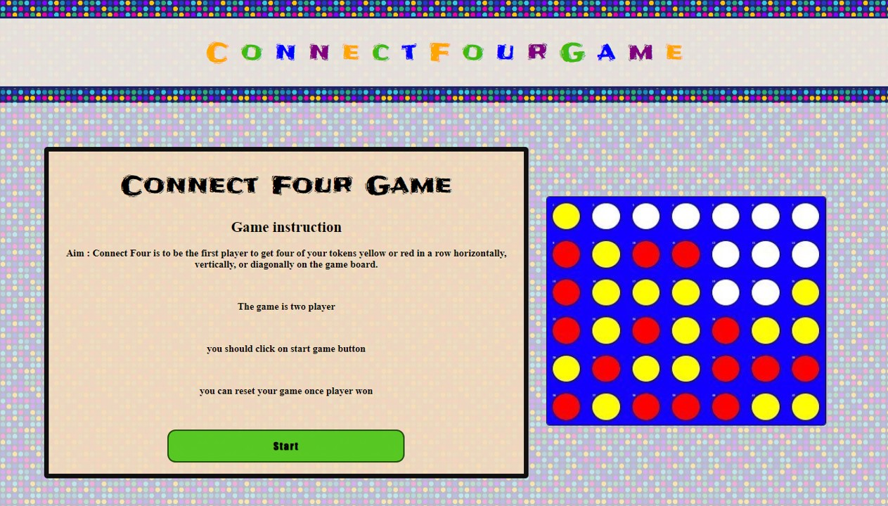
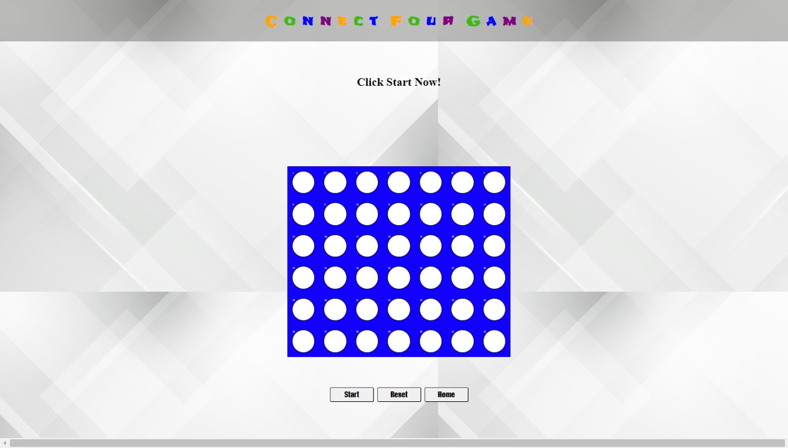
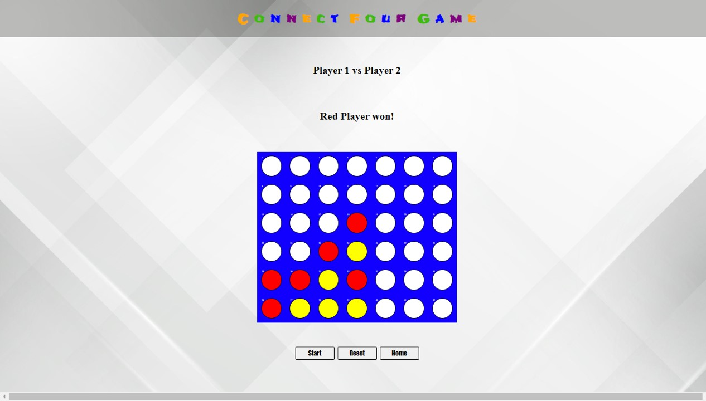

# Connect Four Game

## Date: 2/05/2024

### By: Amal AbdulJalil

---

### **_Description_**

#### Connect four is a two player game . The game strategy is to be the first player to line up four of your colored cells in a row on a board consisting of six rows and seven columns, either horizontally, vertically, or diagonally.The colored cells which are usually red and yellow, are dropped by players in turns into one of the columns, where they land at the lowest point in that column. The round goes on until either all of the cells are in the board filled and there is no winner until one player create a line of four filled cells.

### **_Technologies Used_**

- HTML
- CSS
- JavaScript

---

### **_Getting Started_**

### Process of building connect four

##### First , Make a two Html Page one for Introducing game and instruction and other for display the game then structuring the lay out using grid.

##### Second , style the css and layout add more colors and make it nice .

##### Third, In javaScript make functions and implement the game logic .

##### Finally, Add final touch .

##### Test the game .

### Instruction

##### first player to get four of your tokens yellow or red in a row horizontally, vertically, or diagonally on the game board.

##### The game is two player

##### you should click on start game button

##### you can reset your game once player won

---

### **_Screenshots_**

##### Home Page

##### Game page

---

### **_Credits_**

##### Google Fonts

---
